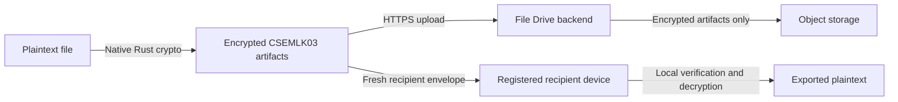

# File Drive Client

A Windows desktop client for **File Drive Lockbox**: client-side encrypted file
storage with authenticated revisions, device-aware sharing, and a JavaFX interface
backed by a native Rust cryptographic core.

The Lockbox design keeps plaintext, file keys, and private signing material on
registered client devices. The backend stores encrypted containers and the
metadata required to validate, version, and deliver them, but is not responsible
for decrypting user content.

> [!IMPORTANT]
> This project is under active development. Its formats and APIs may change. It
> has not undergone an independent security audit and should not yet be treated
> as production-ready cryptographic software.

## Highlights

- Client-side file encryption and authenticated decryption
- Chunked `CSEMLK03` encrypted containers for large-file streaming
- AES-256-GCM content encryption
- ML-KEM-1024 recipient key encapsulation
- ML-DSA-87 signatures for artifact and share authenticity
- HKDF/SHA-3-based key derivation and SHA3-512 artifact verification
- Windows DPAPI protection for local secrets and refresh tokens
- Immutable, hash-linked file revisions with historical export
- Revision-specific, read-only sharing with users or another owned device
- Optional recreation of recipient envelopes when publishing a new revision
- Download/upload progress and cancellation
- Local, web, and shared-file indicators in the JavaFX interface

## Security model

Each file is encrypted locally using fresh file key material. Lockbox produces a
signed artifact set:

```text
<client-file-id>.fdcse       encrypted container
<client-file-id>.fdmanifest  signed size, hashes, identity, and revision chain
<client-file-id>.fdsig       artifact signature record
```

Received shares also use a local `.fdshare` sidecar containing the information
needed to verify and open that particular recipient envelope.

Sharing is revision-specific. A recipient who can open revision 1 does not
automatically receive revision 2. When requested by the owner, the client creates
a **fresh envelope** for each recipient of the new revision; the backend never
copies or rewraps file keys.



### Current trust boundaries

- Private encryption and signing keys remain device-bound.
- The server authorizes users, devices, revisions, and downloads, but cannot
  decrypt file content.
- Received shares grant read access to one immutable revision.
- Self-sharing is also read-only and targets a specific registered device.
- Only the owning device workflow can currently publish the next revision.
- Clearing the backend database destroys its ownership, revision, device, and
  share records even if encrypted objects or local artifacts remain.

## Technology

| Area | Technology |
|---|---|
| Desktop UI | Java 21, JavaFX 21, FXML |
| Networking | Java HTTP Client over HTTPS |
| Native cryptography | Rust 2024 edition exposed through JNI |
| Local secret protection | Windows DPAPI |
| Serialization | Jackson |
| Build and tests | Maven, Cargo, JUnit 5 |
| Backend | File Drive Spring backend (separate project) |

## Requirements

- Windows 10 or Windows 11
- JDK 21
- Rust toolchain with Cargo
- Visual Studio 2022 Build Tools with **Desktop development with C++**
- A running, compatible File Drive Spring backend
- A backend TLS certificate trusted by the JDK used to run the client

The native module currently targets Windows because it integrates with DPAPI and
is loaded as `native_rust.dll`.

## Getting started

### 1. Configure the backend address

Copy the example configuration:

```powershell
Copy-Item .env.example .env
```

For a backend on the same computer:

```dotenv
FDCLIENT_API_BASE_URL=https://localhost:8443
```

For another computer on the local network:

```dotenv
FDCLIENT_API_BASE_URL=https://192.168.100.5:8443
```

The process environment variable takes precedence over `.env`. Only an HTTPS
origin is accepted.

### 2. Build the native library

Run this from a Developer PowerShell for Visual Studio:

```powershell
cd native-rust
cargo build --release
cd ..
```

The DLL will be created at:

```text
native-rust\target\release\native_rust.dll
```

Close any running client before rebuilding; Windows cannot replace a DLL while
the application has it loaded.

### 3. Run the JavaFX client

The JVM must be given the absolute native-library path:

```powershell
$dll = (Resolve-Path .\native-rust\target\release\native_rust.dll).Path
$env:MAVEN_OPTS = "-Dfdclient.native.dll=$dll"
.\mvnw.cmd javafx:run
```

In IntelliJ IDEA, add the following under **Run/Debug Configurations → VM
options**:

```text
-Dfdclient.native.dll=C:\absolute\path\to\FD-Client\native-rust\target\release\native_rust.dll
```

Keep any existing VM options; separate options with spaces.

## Testing

Run the Java test suite:

```powershell
.\mvnw.cmd test
```

Run the Rust test suite from a normal Windows user session so DPAPI is available:

```powershell
cd native-rust
cargo test
```

DPAPI tests can fail inside service accounts, containers, or restricted sandbox
sessions even when the code works under an interactive Windows account.

## Typical workflow

1. Sign in to File Drive.
2. Activate Lockbox and register the current device.
3. Select and encrypt a local file.
4. Upload the signed encrypted artifact set.
5. Download or decrypt/export it from a registered device.
6. Share a specific revision with a user or another owned device.
7. Upload a hash-linked revision and optionally recreate its shares using fresh
   recipient envelopes.

## Repository layout

```text
native-rust/                 Rust cryptographic core and JNI exports
src/main/java/               JavaFX controllers, services, and native bridge
src/main/resources/          FXML views
src/test/java/               Java contract and service tests
.env.example                 Backend URL example
pom.xml                      Java/Maven configuration
```

## Roadmap

The following features are planned and are **not yet implemented**.

### File and folder synchronization

- Background synchronization between registered devices and encrypted web storage
- File-system change detection and resumable transfers
- Revision-aware conflict detection and explicit conflict resolution
- Selective synchronization for chosen files and folders
- Safe handling of renames, deletions, offline changes, and interrupted transfers
- Cross-device availability without weakening the client-side encryption model

### ESP32 hardware security device

A custom ESP32-based companion device is planned to act as an independent
hardware security boundary with three roles:

1. **Signing key device** — approve operations and produce signatures without
   exporting the private signing key.
2. **KEK hardware wallet** — hold or derive a key-encryption key used to protect
   file-key material, with sensitive operations confirmed on the device.
3. **TOTP two-factor authenticator** — generate time-based one-time passwords for
   account authentication.

The design will require authenticated host-device communication, secure
provisioning, encrypted key storage, firmware update verification, anti-rollback
controls, recovery procedures, and explicit on-device user confirmation. ESP32
support will be introduced as an optional hardware-backed mode rather than
silently changing the current software-key format.

### Longer-term multi-device capabilities

- Read-only subscriptions to future revisions (`FOLLOW`)
- Owner-signed device capabilities for uploading a new revision
- Atomic expected-revision conflict protection across multiple writers
- Device and capability revocation with an auditable event history
- Hardware-backed key migration and recovery workflows

## Contributing

Issues and focused pull requests are welcome. For cryptographic or protocol
changes, document the exact byte-level format, domain-separation values, key
ownership, failure behavior, and compatibility impact. New behavior should include
both positive tests and tamper/failure tests.

Please do not commit:

- `.env` files or credentials
- TLS private keys or keystores
- DPAPI-protected user material
- generated Lockbox artifacts
- native or Maven build output

## Security reports

Please avoid publishing exploitable security findings in a public issue. Contact
the repository owner privately with reproduction steps, affected versions, and
the expected impact.

## License

No license has been declared yet. Until one is added, all rights remain reserved
by the repository owner.
